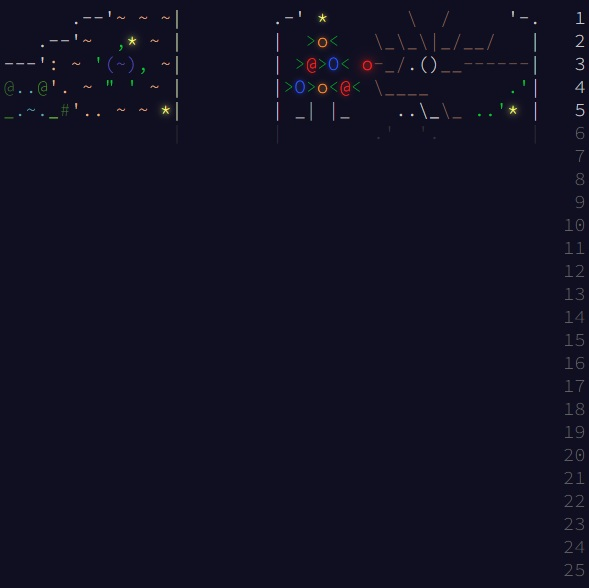

# Advent of Code (2024)
This repository contains my solutions for [Advent of Code 2024](https://adventofcode.com/2024). Written in C#, .NET 8.0 and with NUnit tests.

## About Advent of Code ##

[Advent of Code](https://adventofcode.com/) is an annual event ran in December each year. Each day a new puzzle is released, with two parts. The event can be used to hone your skills or learn a new programming language. It is open to all from, developers, database admins and spreadhseet whizzes.

## Project Structure ## 
The repository is organised as follows:
```
📂 Advent-of-Code-2024
├── 📂 src                     # src for solutions
    ├── 📂 Day 1               # Solution for Day 1 (Day 2 is in folder Day 2, Day 3 is in folder Day 3 etc)
    ├── 📂 FileParse           # Shared code for reading file contents
├── 📂 tests                   # Unit tests
    ├── 📂 Day 1               # unit tests for Day 1 (Day 2 is in folder Day 2, Day 3 is in folder Day 3 etc)
    ├── 📂 FileParse.Tests     # Unit tests for FileParse
└── AdventOfCode_2024.sln  # Solution file
```

In side the solution the projects and tests are found in the same folder

## Calendar ##
<a href="https://adventofcode.com/2024"></a>

## Additional Info ##
In order to respect the [TOS](https://adventofcode.com/2024/about) of this event, this repository will not contain the file inputs and puzzle texts until the end of the event.

Read me style based on https://github.com/Berat02xz/AdventOfCode_2024/
